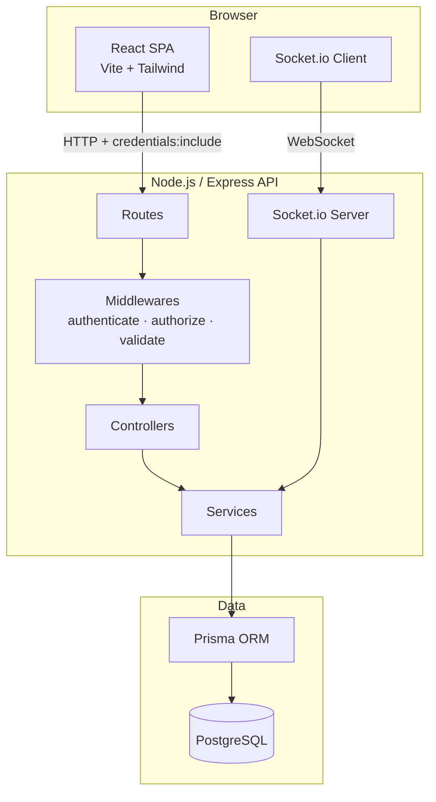
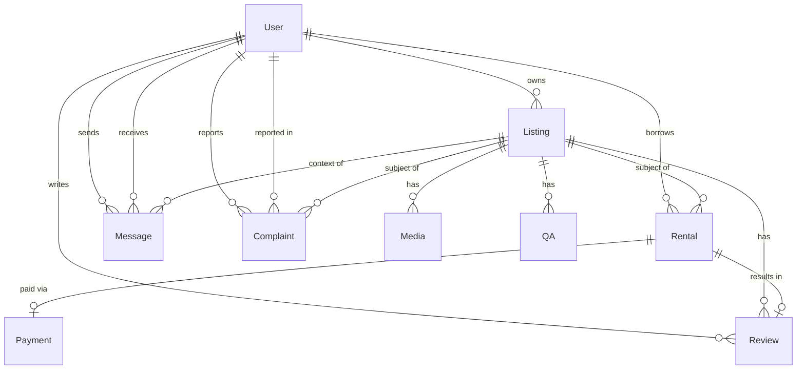
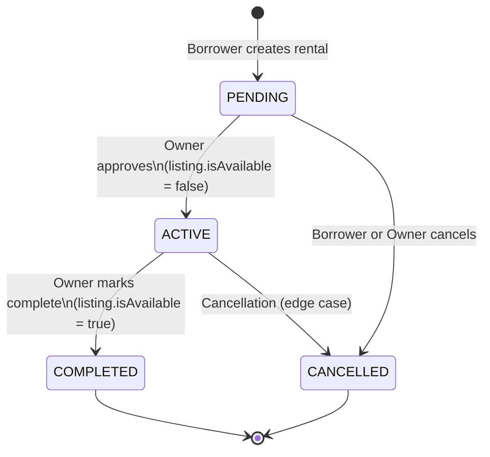

# Design Document — RentAnything (RentIt) Platform

## Overview

RentIt is a full-stack peer-to-peer rental marketplace. Users list items they own, discover and rent items from others, communicate in real time, pay for rentals, leave reviews, and submit complaints. An admin role provides platform-wide oversight.

### UI-First Implementation Strategy

> **Critical:** The very first implementation task scaffolds the **complete frontend** with all pages, routing, layout, and UI components fully working and visually pixel-consistent with the reference design — using mock/static data. Every subsequent task progressively replaces mock data with real API calls and adds backend functionality. This means the user can see the full UI running from Task 1 and observe each feature come alive as backend wiring is added.

Task ordering follows this pattern:
1. **Task 1** — Full frontend scaffold (all pages + routing + mock data)
2. **Tasks 2–N** — Backend features wired in one domain at a time (auth → listings → rentals → payments → chat → admin → chatbot)

### Tech Stack

| Layer | Technology |
|---|---|
| Frontend | React 18 + Vite + Tailwind CSS v4 |
| Backend | Node.js + Express |
| Database | PostgreSQL + Prisma ORM |
| Auth | JWT in HTTP-only cookies |
| Realtime | Socket.io |
| Testing (BE) | Jest + Supertest |
| Testing (FE) | Vitest |

---

## Architecture

### High-Level System Diagram



### Request Lifecycle

```
Browser → HTTP Request (cookie: jwt)
  → Express Router
    → authenticate middleware (verify JWT from cookie)
    → authorize middleware (check role if needed)
    → validateRequest middleware (express-validator)
    → Controller (thin — orchestrates service calls)
      → Service (business logic)
        → Prisma (DB query)
      ← Service result
    ← Controller response (JSON)
  ← HTTP Response
```

### Frontend Routing Structure

```
/                       LandingPage          (public)
/auth                   AuthPage             (public)
/app                    DashboardLayout      (protected, lazy)
  /app                  Dashboard (Home)
  /app/categories       CategoriesPage
  /app/popular          PopularPage
  /app/product/:id      ProductDetail
  /app/rent-out         RentOutPage
  /app/about            AboutPage
  /app/settings         SettingsPage
  /app/chat             ChatPage
  /app/chat/:listingId/:userId  ChatThread
/admin                  AdminLayout          (protected + admin role)
  /admin                AdminDashboard
  /admin/users          AdminUsers
  /admin/complaints     AdminComplaints
```

All `/app/*` and `/admin/*` routes are lazy-loaded via `React.lazy` + `Suspense`.

---

## Components and Interfaces

### Frontend Directory Structure

```
frontend/
  src/
    components/
      Navbar.tsx              # Fixed top nav for landing page
      Footer.tsx              # Shared footer
      ListingCard.tsx         # Reusable product card (aspect-square image, name, price, stars)
      StarRating.tsx          # Filled/empty star renderer
      ChatWidget.tsx          # Floating chatbot button + slide-up panel
      CartPanel.tsx           # Slide-in cart panel with backdrop
      ProtectedRoute.tsx      # Redirects unauthenticated users
      AdminRoute.tsx          # Redirects non-admin users
      LoadingSpinner.tsx
      ErrorBoundary.tsx
    pages/
      LandingPage.tsx
      AuthPage.tsx
      Dashboard.tsx
      CategoriesPage.tsx
      PopularPage.tsx
      ProductDetail.tsx
      RentOutPage.tsx
      AboutPage.tsx
      SettingsPage.tsx
      ChatPage.tsx
      AdminDashboard.tsx
      AdminUsers.tsx
      AdminComplaints.tsx
    layouts/
      DashboardLayout.tsx     # Collapsible sidebar + cart FAB + outlet
      AdminLayout.tsx
    services/
      api.ts                  # Base axios instance (credentials: 'include', baseURL)
      authService.ts          # register, login, logout, forgotPassword, resetPassword
      listingService.ts       # getListings, getListing, createListing, updateListing, deleteListing
      rentalService.ts        # createRental, getRentals, getRental, approve, complete, cancel
      paymentService.ts       # pay
      messageService.ts       # getMessages, sendMessage
      reviewService.ts        # getReviews, submitReview, getQAs, submitQuestion
      complaintService.ts     # submitComplaint, getComplaints
      adminService.ts         # getUsers, updateUser, getComplaints, updateComplaint, getStats
      chatbotService.ts       # sendMessage
    hooks/
      useAuth.ts              # Reads AuthContext, exposes user/login/logout
      useListings.ts          # Fetches + filters listings
      useChat.ts              # Socket.io connection management
      useCart.ts              # Reads CartContext
      useInactivityTimer.ts   # 30-min idle → logout
    context/
      AuthContext.tsx          # user state, login(), logout()
      CartContext.tsx          # items[], addItem(), removeItem(), clearCart()
    utils/
      formatPrice.ts          # "$X/day" formatter
      calculateDays.ts        # date range → number of days
      validateEmail.ts        # RFC 5322 regex
      validatePassword.ts     # 8+ chars, 1 uppercase, 1 digit
    App.tsx                   # Router setup, lazy imports, Suspense boundaries
    main.tsx
    index.css                 # Tailwind directives + theme.css tokens
```

### Key Component Interfaces

```typescript
// ListingCard props
interface ListingCardProps {
  listing: Listing;
  rank?: number;           // 1|2|3 for Popular page badges
  variant?: 'square' | 'video';  // aspect-square (default) or aspect-video (featured row)
}

// StarRating props
interface StarRatingProps {
  rating: number;          // 0–5, supports decimals
  size?: 'sm' | 'md';
  showCount?: boolean;
  count?: number;
}

// CartContext value
interface CartContextValue {
  items: CartItem[];
  addItem: (listing: Listing) => void;
  removeItem: (listingId: string) => void;
  clearCart: () => void;
  total: number;
}

// AuthContext value
interface AuthContextValue {
  user: AuthUser | null;
  isLoading: boolean;
  login: (email: string, password: string, rememberMe: boolean) => Promise<void>;
  logout: () => Promise<void>;
}
```

### Backend Directory Structure

```
backend/
  src/
    controllers/
      authController.ts
      listingController.ts
      rentalController.ts
      paymentController.ts
      messageController.ts
      reviewController.ts
      complaintController.ts
      adminController.ts
      chatbotController.ts
    services/
      authService.ts
      listingService.ts
      rentalService.ts
      paymentService.ts
      chatService.ts
      reviewService.ts
      complaintService.ts
      adminService.ts
      chatbotService.ts
    routes/
      auth.ts
      listings.ts
      rentals.ts
      payments.ts
      messages.ts
      reviews.ts
      complaints.ts
      admin.ts
      chatbot.ts
    middlewares/
      authenticate.ts       # Verify JWT from HTTP-only cookie
      authorize.ts          # Role-based access (authorize('ADMIN'))
      validateRequest.ts    # Run express-validator, return 422 on errors
    validators/
      authValidator.ts
      listingValidator.ts
      rentalValidator.ts
      reviewValidator.ts
      complaintValidator.ts
    utils/
      tokenUtils.ts         # signToken, verifyToken
      emailUtils.ts         # sendPasswordResetEmail (nodemailer / stub)
    socket/
      index.ts              # Socket.io server setup + event handlers
    app.ts                  # Express app setup (CORS, cookie-parser, routes)
    server.ts               # HTTP server + Socket.io attach + listen
  prisma/
    schema.prisma
  __tests__/
    auth.test.ts
    listings.test.ts
    rentals.test.ts
    payments.test.ts
```

### API Endpoint Reference

| Method | Path | Auth | Description |
|---|---|---|---|
| POST | /api/auth/register | — | Register new user |
| POST | /api/auth/login | — | Login, set JWT cookie |
| POST | /api/auth/logout | ✓ | Clear JWT cookie |
| POST | /api/auth/forgot-password | — | Send reset email |
| POST | /api/auth/reset-password | — | Reset with token |
| GET | /api/listings | ✓ | List all (search, category, page) |
| POST | /api/listings | ✓ | Create listing |
| GET | /api/listings/:id | ✓ | Get single listing |
| PUT | /api/listings/:id | ✓ Owner | Update listing |
| DELETE | /api/listings/:id | ✓ Owner | Delete listing |
| GET | /api/rentals | ✓ | Get user's rentals |
| POST | /api/rentals | ✓ | Create rental request |
| GET | /api/rentals/:id | ✓ | Get rental detail |
| POST | /api/rentals/:id/approve | ✓ Owner | Approve rental |
| POST | /api/rentals/:id/complete | ✓ Owner | Complete rental |
| POST | /api/rentals/:id/cancel | ✓ | Cancel rental |
| POST | /api/payments/:rentalId/pay | ✓ | Simulate payment |
| GET | /api/messages/:listingId/:userId | ✓ | Get conversation |
| POST | /api/messages/:listingId/:userId | ✓ | Send message |
| GET | /api/listings/:id/reviews | ✓ | Get reviews |
| POST | /api/listings/:id/reviews | ✓ | Submit review |
| GET | /api/listings/:id/qa | ✓ | Get Q&A |
| POST | /api/listings/:id/qa | ✓ | Submit question |
| GET | /api/complaints | ✓ | Get user's complaints |
| POST | /api/complaints | ✓ | Submit complaint |
| GET | /api/admin/users | ✓ Admin | List all users |
| PATCH | /api/admin/users/:id | ✓ Admin | Update user (role/isActive) |
| GET | /api/admin/complaints | ✓ Admin | List all complaints |
| PATCH | /api/admin/complaints/:id | ✓ Admin | Resolve complaint |
| GET | /api/admin/stats | ✓ Admin | Platform statistics |
| POST | /api/chatbot/message | ✓ | Chatbot query |

### Socket.io Events

```
Client → Server:
  join_room    { roomId: `${listingId}_${userId1}_${userId2}` }
  send_message { roomId, senderId, receiverId, listingId, content }
  disconnect

Server → Client:
  receive_message { id, senderId, receiverId, listingId, content, createdAt }
```

Room ID is deterministic: `${listingId}_${[userId1, userId2].sort().join('_')}` — ensures both participants join the same room regardless of who initiates.

---

## Data Models

### Prisma Schema

```prisma
generator client {
  provider = "prisma-client-js"
}

datasource db {
  provider = "postgresql"
  url      = env("DATABASE_URL")
}

model User {
  id        String   @id @default(cuid())
  name      String
  email     String   @unique
  password  String
  role      Role     @default(USER)
  isActive  Boolean  @default(true)
  phone     String?
  emailNotifications Boolean @default(true)
  smsNotifications   Boolean @default(false)
  marketingEmails    Boolean @default(true)
  createdAt DateTime @default(now())
  listings  Listing[]
  rentals   Rental[]  @relation("BorrowerRentals")
  sentMessages     Message[] @relation("SentMessages")
  receivedMessages Message[] @relation("ReceivedMessages")
  complaints       Complaint[] @relation("ReporterComplaints")
  reportedComplaints Complaint[] @relation("ReportedComplaints")
  reviews   Review[]
  passwordResetToken  String?
  passwordResetExpiry DateTime?
}

model Listing {
  id            String   @id @default(cuid())
  title         String
  description   String
  pricePerDay   Float
  depositAmount Float    @default(0)
  category      String
  location      String
  isAvailable   Boolean  @default(true)
  isFeatured    Boolean  @default(false)
  ownerId       String
  owner         User     @relation(fields: [ownerId], references: [id])
  media         Media[]
  rentals       Rental[]
  messages      Message[]
  complaints    Complaint[]
  reviews       Review[]
  qas           QA[]
  createdAt     DateTime @default(now())
}

model Media {
  id        String  @id @default(cuid())
  listingId String
  listing   Listing @relation(fields: [listingId], references: [id], onDelete: Cascade)
  url       String
  type      String  @default("image")
}

model Rental {
  id         String       @id @default(cuid())
  listingId  String
  listing    Listing      @relation(fields: [listingId], references: [id])
  borrowerId String
  borrower   User         @relation("BorrowerRentals", fields: [borrowerId], references: [id])
  startDate  DateTime
  endDate    DateTime
  totalPrice Float
  status     RentalStatus @default(PENDING)
  payment    Payment?
  review     Review?
  createdAt  DateTime     @default(now())
}

model Payment {
  id        String        @id @default(cuid())
  rentalId  String        @unique
  rental    Rental        @relation(fields: [rentalId], references: [id])
  amount    Float
  status    PaymentStatus @default(PENDING)
  createdAt DateTime      @default(now())
}

model Message {
  id         String   @id @default(cuid())
  senderId   String
  sender     User     @relation("SentMessages", fields: [senderId], references: [id])
  receiverId String
  receiver   User     @relation("ReceivedMessages", fields: [receiverId], references: [id])
  listingId  String
  listing    Listing  @relation(fields: [listingId], references: [id])
  content    String
  createdAt  DateTime @default(now())
}

model Complaint {
  id               String          @id @default(cuid())
  reporterId       String
  reporter         User            @relation("ReporterComplaints", fields: [reporterId], references: [id])
  reportedUserId   String?
  reportedUser     User?           @relation("ReportedComplaints", fields: [reportedUserId], references: [id])
  listingId        String?
  listing          Listing?        @relation(fields: [listingId], references: [id])
  description      String
  status           ComplaintStatus @default(OPEN)
  resolvedAt       DateTime?
  createdAt        DateTime        @default(now())
}

model Review {
  id         String   @id @default(cuid())
  listingId  String
  listing    Listing  @relation(fields: [listingId], references: [id])
  reviewerId String
  reviewer   User     @relation(fields: [reviewerId], references: [id])
  rentalId   String   @unique
  rental     Rental   @relation(fields: [rentalId], references: [id])
  rating     Int
  comment    String
  createdAt  DateTime @default(now())
}

model QA {
  id         String   @id @default(cuid())
  listingId  String
  listing    Listing  @relation(fields: [listingId], references: [id])
  askerId    String
  question   String
  answer     String?
  answeredBy String?
  createdAt  DateTime @default(now())
}

enum Role            { ADMIN USER }
enum RentalStatus    { PENDING ACTIVE COMPLETED CANCELLED }
enum PaymentStatus   { PENDING PAID FAILED }
enum ComplaintStatus { OPEN RESOLVED }
```

### Entity Relationship Diagram



### Rental Status State Machine



### Auth Flow

```mermaid
sequenceDiagram
    participant C as Client
    participant S as Server
    participant DB as Database

    C->>S: POST /auth/login { email, password, rememberMe }
    S->>DB: Find user by email
    DB-->>S: User record
    S->>S: bcrypt.compare(password, hash)
    S->>S: signToken(userId, role, expiry: rememberMe ? 30d : 30m)
    S-->>C: Set-Cookie: jwt=<token>; HttpOnly; SameSite=Strict
    Note over C: useInactivityTimer starts 30-min countdown
    C->>S: Any request (cookie auto-sent)
    S->>S: verifyToken(cookie.jwt)
    S-->>C: 401 if expired/missing
```

---

## Correctness Properties

*A property is a characteristic or behavior that should hold true across all valid executions of a system — essentially, a formal statement about what the system should do. Properties serve as the bridge between human-readable specifications and machine-verifiable correctness guarantees.*

### Property 1: Rental price calculation is deterministic

*For any* listing with a positive `pricePerDay` and any valid date range (startDate < endDate), the calculated `totalPrice` SHALL equal `pricePerDay × numberOfDays` where `numberOfDays = ceil((endDate - startDate) / 86400000)`.

**Validates: Requirements 8.2**

### Property 2: Password validation rejects all non-conforming inputs

*For any* string that is missing at least one of: minimum 8 characters, at least 1 uppercase letter, at least 1 numeric digit — the `Password_Validator` SHALL reject it and return a validation error.

**Validates: Requirements 1.3**

### Property 3: Whitespace-only and empty task descriptions are invalid

*For any* string composed entirely of whitespace characters (including the empty string), the listing title validator SHALL reject it and prevent form submission.

**Validates: Requirements 4.5, 22.1**

### Property 4: Review rating is always within bounds

*For any* review submission, the `Review_Service` SHALL reject any rating value that is not an integer in the closed interval [1, 5].

**Validates: Requirements 13.2**

### Property 5: Rental price invariant across listing price changes

*For any* rental record that has been created, the stored `totalPrice` SHALL remain unchanged even if the associated listing's `pricePerDay` is subsequently updated.

**Validates: Requirements 8.2, 8.3**

### Property 6: Cart total equals sum of item prices

*For any* cart state containing N items, the displayed total SHALL equal the arithmetic sum of each item's `pricePerDay`.

**Validates: Requirements 15.3**

### Property 7: Unavailable listing blocks rental creation

*For any* listing with `isAvailable = false`, a rental creation request targeting that listing SHALL be rejected with an error response, regardless of the requesting user or date range.

**Validates: Requirements 8.7**

### Property 8: Password reset token is single-use

*For any* password reset token that has been successfully used to reset a password, a subsequent attempt to use the same token SHALL be rejected with an invalid/expired token error.

**Validates: Requirements 3.5**

### Property 9: One review per completed rental

*For any* completed rental, submitting a second review for the same rental SHALL be rejected by the `Review_Service` with a duplicate review error.

**Validates: Requirements 13.4**

### Property 10: Admin-only routes reject non-admin users

*For any* authenticated user with role `USER`, a request to any `/api/admin/*` route SHALL return a 403 Forbidden response.

**Validates: Requirements 19.7**

---

## Error Handling

### Client-Side Error Handling

- All service functions in `/src/services` wrap axios calls in try/catch and throw typed errors.
- React components catch errors via `ErrorBoundary` for unexpected crashes.
- Form validation runs client-side first (using `validateEmail`, `validatePassword` utils) before any API call.
- Network errors display a toast notification: "Something went wrong. Please try again." — no internal details exposed.
- 401 responses from any API call trigger automatic logout and redirect to `/auth`.
- 403 responses display an "Access denied" message.

### Server-Side Error Handling

- All controllers are wrapped in async error handlers; unhandled promise rejections are caught by a global Express error middleware.
- `validateRequest` middleware runs `validationResult(req)` and returns `422 Unprocessable Entity` with field-level errors:
  ```json
  { "errors": [{ "field": "email", "message": "Invalid email format" }] }
  ```
- Authentication errors return `401 Unauthorized` with `{ "error": "Authentication required" }`.
- Authorization errors return `403 Forbidden` with `{ "error": "Insufficient permissions" }`.
- Not-found errors return `404 Not Found` with `{ "error": "Resource not found" }`.
- Duplicate email on registration returns `409 Conflict` with `{ "error": "Email already registered" }`.
- Generic server errors return `500 Internal Server Error` with `{ "error": "Internal server error" }` — stack traces are never sent to the client.

### Inactivity Timeout

The `useInactivityTimer` hook listens for `mousemove`, `keydown`, `click`, and `scroll` events. If no event fires within 30 minutes, it calls `authService.logout()` and redirects to `/auth`. The timer resets on every user interaction. When "Remember Me" is active (30-day JWT), the inactivity timer is disabled.

---

## Testing Strategy

### Backend — Jest + Supertest

**Unit tests** cover pure service logic:
- `authService`: password hashing, token generation, token verification, inactivity expiry logic
- `rentalService`: `calculateTotalPrice`, status transition guards, availability checks
- `paymentService`: simulated payment record creation (paid/failed paths)

**Integration tests** use Supertest against a test database (separate `DATABASE_URL_TEST` env var):
- `POST /api/auth/register` — valid registration, duplicate email, missing fields, weak password
- `POST /api/auth/login` — valid credentials, wrong password, deactivated account
- `POST /api/auth/logout` — clears cookie
- `GET /api/listings` — returns listings, supports search query param
- `POST /api/listings` — authenticated creation, validation errors
- `PUT /api/listings/:id` — owner can update, non-owner gets 403
- `DELETE /api/listings/:id` — owner can delete, non-owner gets 403

### Frontend — Vitest

**Unit tests** cover:
- `formatPrice` utility: `formatPrice(45)` → `"$45/day"`
- `calculateDays` utility: correct day count for various date ranges
- `validateEmail` utility: valid/invalid email strings
- `validatePassword` utility: all rule combinations
- `CartContext`: add, remove, total calculation
- `StarRating` component: renders correct filled/empty stars for given rating

### Property-Based Tests — fast-check (Vitest)

Each property test runs a minimum of 100 iterations.

**Property 1 — Rental price calculation:**
```
Feature: rent-anything-platform, Property 1: Rental price is pricePerDay × days
```
Generate: random `pricePerDay` (positive float), random valid date range.
Assert: `calculateTotalPrice(pricePerDay, start, end) === pricePerDay * days`.

**Property 2 — Password validator rejects non-conforming inputs:**
```
Feature: rent-anything-platform, Property 2: Password validator rejects non-conforming inputs
```
Generate: strings that violate at least one rule (too short, no uppercase, no digit).
Assert: `validatePassword(s)` returns false.

**Property 3 — Whitespace inputs are invalid:**
```
Feature: rent-anything-platform, Property 3: Whitespace-only strings are invalid listing titles
```
Generate: strings composed entirely of whitespace characters.
Assert: listing title validator rejects them.

**Property 4 — Review rating bounds:**
```
Feature: rent-anything-platform, Property 4: Review rating must be integer in [1,5]
```
Generate: integers outside [1, 5] and non-integer numbers.
Assert: `validateRating(r)` returns false for all generated values.

**Property 6 — Cart total:**
```
Feature: rent-anything-platform, Property 6: Cart total equals sum of item prices
```
Generate: random arrays of cart items with random `pricePerDay` values.
Assert: `calculateCartTotal(items) === items.reduce((sum, i) => sum + i.pricePerDay, 0)`.

### Test Configuration

- Backend: `jest.config.ts` with `testEnvironment: 'node'`, `setupFilesAfterFramework` for Prisma test client
- Frontend: `vitest.config.ts` with `environment: 'jsdom'`, `setupFiles: ['@testing-library/jest-dom']`
- Property tests: `fast-check` library, minimum 100 runs per property (`fc.assert(fc.property(...), { numRuns: 100 })`)
- Test files co-located in `__tests__` directories adjacent to source files
